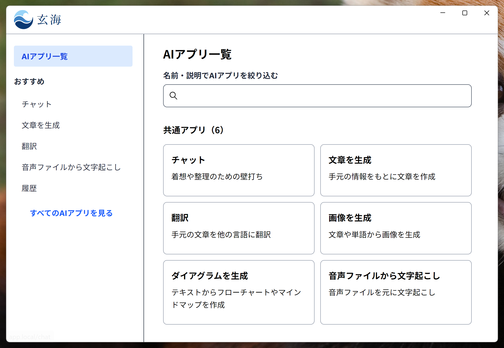
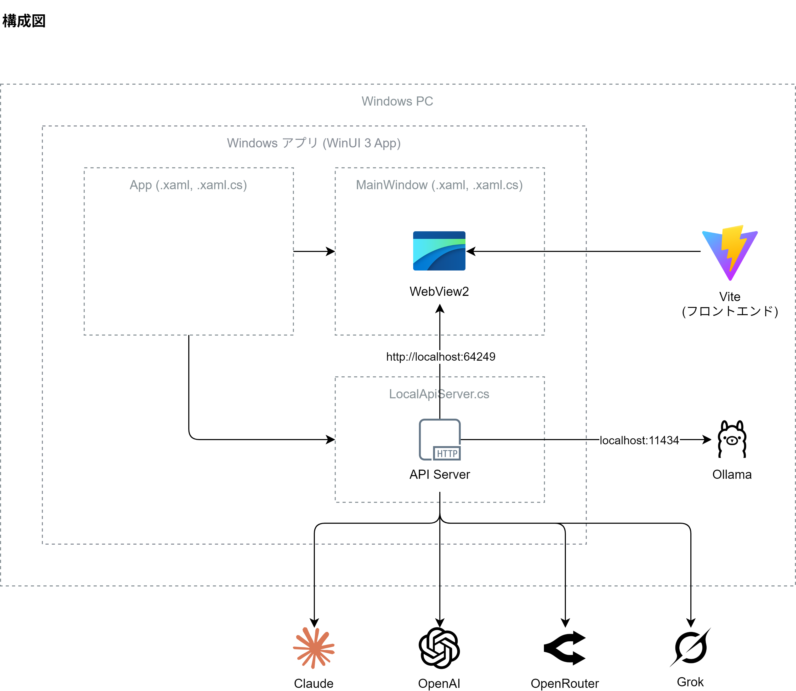

# 玄海 (GenkAI)

源内 Web (https://github.com/digital-go-jp/genai-web) を改変したリポジトリです。



## 構成図



## 概要

玄海（GenkAI）は、デジタル庁が開発・運用する生成 AI 利活用基盤である源内 (genai-web) を改変したデスクトップアプリです。

業務特化の生成 AI アプリケーションを、迅速かつ安全かつ簡単に利用できる環境を提供します。
クラウドやサーバー等は不使用で、生成 AI の API を呼びだすことを除き、PC 内で完結します。

## ドキュメント

### セットアップ

[AGENTS.md](AGENTS.md) を参照してください。

## 汎用的な AI アプリ

汎用的な AI アプリは、各社 AI プロバイダの API キーの設定のみでユーザーが利用できます。  
汎用的な AI アプリは以下のアプリが該当します。

- チャット
    - WebSearch (ウェブ検索ツール)
    - WebFetch (ページ取得ツール)
- 文章生成
- 翻訳
- 画像生成
- ダイアグラム生成

### 使用可能なモデル

デフォルトで以下のモデルが利用可能です。

| プロバイダー | 用途 | モデルID |
| --- | --- | --- |
| Ollama | テキスト生成 | `ollama/gemma4:e4b` |
| Ollama | テキスト生成 | `ollama/qwen3.5:9b` |
| Anthropic | テキスト生成 | `anthropic/claude-opus-4-7` |
| Anthropic | テキスト生成 | `anthropic/claude-sonnet-4-6` |
| Anthropic | テキスト生成 | `anthropic/claude-haiku-4-5` |
| OpenAI | テキスト生成 | `openai/gpt-5.4` |
| OpenAI | テキスト生成 | `openai/gpt-5.4-mini` |
| OpenAI | テキスト生成 | `openai/gpt-5.4-nano` |
| xAI | テキスト生成 | `xai/grok-4.3` |
| xAI | テキスト生成 | `xai/grok-4-fast` |
| OpenRouter | テキスト生成 | `openrouter/qwen/qwen3.6-35b-a3b` |
| OpenRouter | テキスト生成 | `openrouter/deepseek/deepseek-v4-flash` |
| xAI | 画像生成 | `xai/grok-imagine-image` |
| OpenAI | 画像生成 | `openai/gpt-image-2` |
| OpenAI | 画像生成 | `openai/gpt-4o-image` |

## 環境変数の設定
API キーを環境変数に設定することで、モデルが使用可能となります。

### API キーの設定
使用するプロバイダーの API キーを設定します。

| 変数名 | 説明 |
| --- | --- |
| `OPENAI_API_KEY` | OpenAI API キー |
| `ANTHROPIC_API_KEY` | Anthropic API キー |
| `XAI_API_KEY` | xAI API キー |
| `OPENROUTER_API_KEY` | OpenRouter API キー |

Ollama はローカルで動作するため API キーは不要です。

## インストーラーの作成
以下のスクリプトを実行すると、Install.exe が作成されます。

```ps1
.\publish.ps1
```

## ライセンス

- Software: Licensed under the [MIT License](LICENSE).